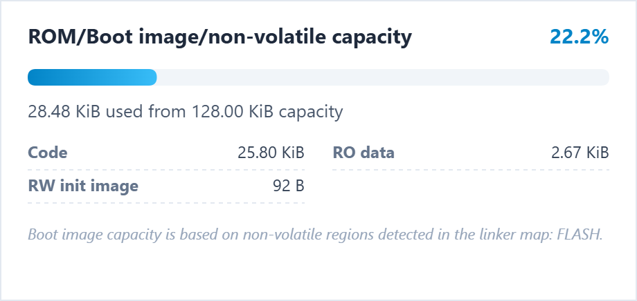
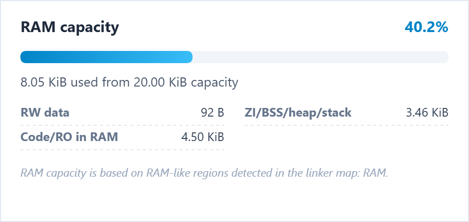
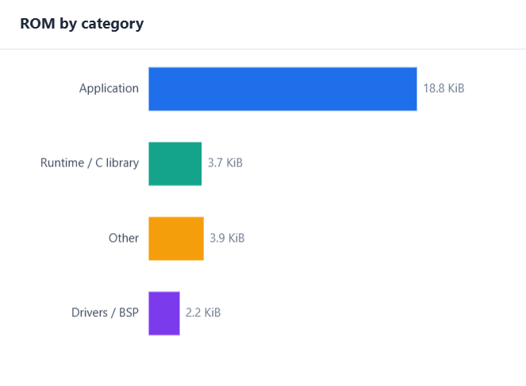
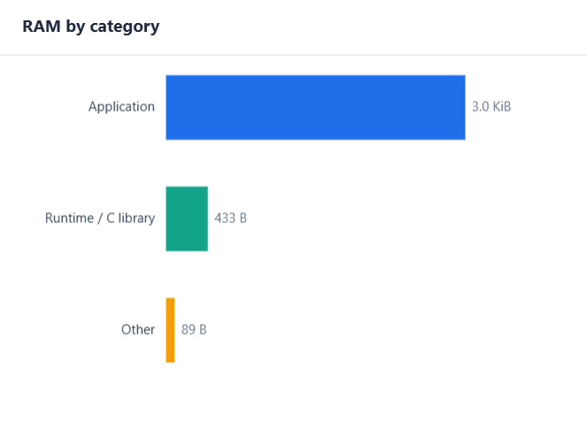
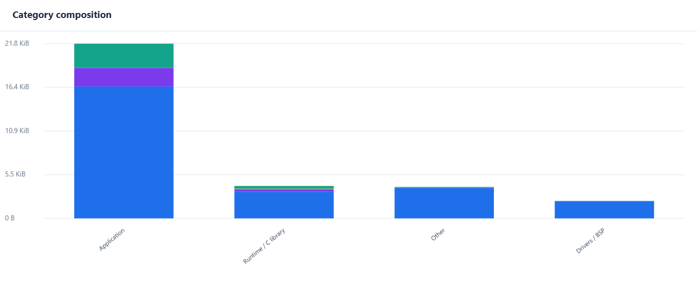
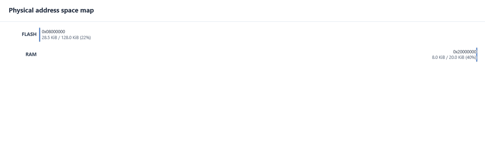
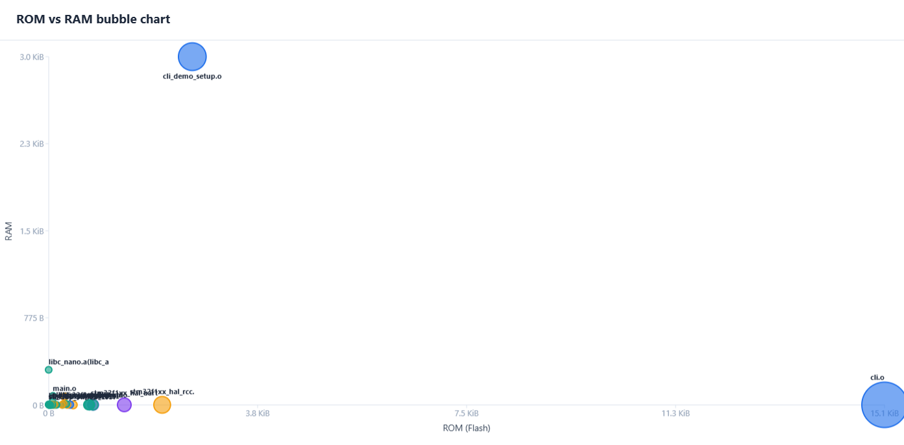
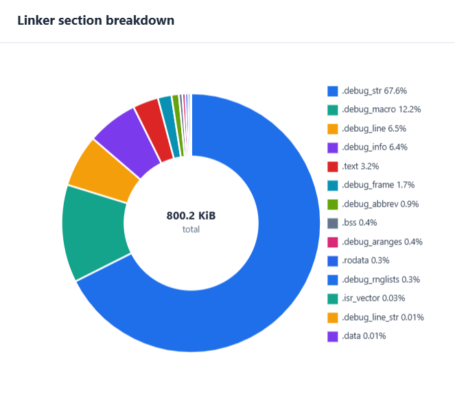
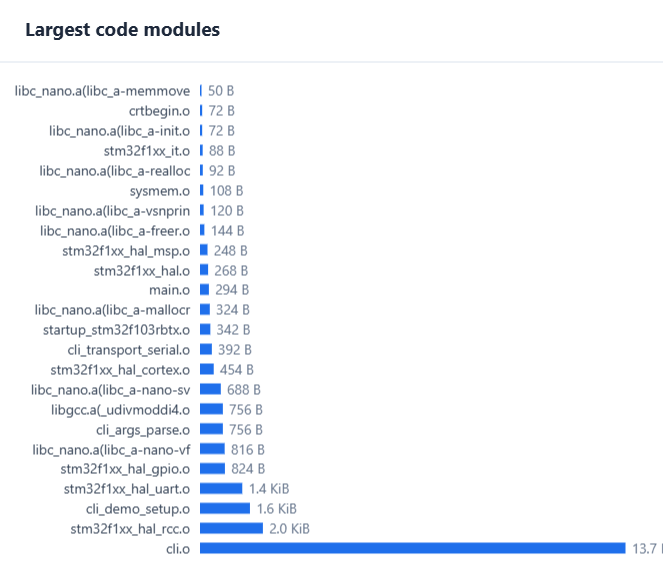

# Mapfile Analyzer

A standalone Python utility for firmware memory analysis. It parses linker map files from major toolchains—including GCC/Clang, IAR, and Keil—and generates a comprehensive, single-file HTML report detailing memory regions, section composition, and symbol statistics.

## Table of Contents

- [Report sections](#report-sections)
- [Screenshots](#screenshots)
- [Notes](#notes)
- [Project setup](#project-setup)
- [Usage](#usage)
- [Standalone Executable](#standalone-executable)
- [Contributions](#contributions)
- [License](#license)
- [Author](#author)

## Report sections

The HTML report keeps the full dashboard layout:

- Overview cards: ROM image, RAM use, Code, RO data, RW data, ZI/BSS, Debug/other, Objects
- Boot/non-volatile capacity and runtime RAM capacity
- Memory regions table
- ROM by category chart
- RAM by category chart
- Category composition chart
- Module analysis tabs: Top ROM, Top Code, Top RAM, Libraries
- Largest code modules chart
- Section breakdown
- Archive/library breakdown
- Source-file estimate
- Largest symbols/functions when symbol-size data is present
- Linker script info — when a linker script is supplied (`--linker-file`), shows parsed memory regions, output sections, input section placements, heap/stack sizes, and the raw linker source in a tabbed viewer

## Screenshots

<table>
  <tr>
    <td align="center"><br><em>ROM / Boot capacity</em></td>
    <td align="center"><br><em>RAM capacity</em></td>
  </tr>
  <tr>
    <td align="center"><br><em>ROM by category</em></td>
    <td align="center"><br><em>RAM by category</em></td>
  </tr>
  <tr>
    <td align="center"><br><em>Category composition</em></td>
    <td align="center"><br><em>Physical address space map</em></td>
  </tr>
  <tr>
    <td align="center"><br><em>ROM vs RAM bubble chart</em></td>
    <td align="center"><br><em>Memory treemap</em></td>
  </tr>
  <tr>
    <td align="center"><br><em>Linker section breakdown</em></td>
    <td align="center"><br><em>Largest code modules</em></td>
  </tr>
</table>

## Notes

Map files are not standardized. The parser uses best-effort format profiles and heuristics. Verify critical values against the linker output when introducing a new toolchain or custom linker script.

When the linker map does not expose the capacity you want to use for the dashboard, pass it explicitly with `--rom-capacity` and `--ram-capacity`. Values accept raw bytes, hex, or `KiB`/`MiB`/`GiB` style suffixes.

## Project setup

It is recommended to run the project inside a virtual environment:

```bash
# 1. Create a virtual environment
python -m venv .venv

# 2. Activate it
# Windows:
.venv\Scripts\activate
# Linux/macOS:
source .venv/bin/activate

# 3. Install in editable mode
pip install -e .
```

## Usage

```bash
python openmapfileanalzyer.py firmware.map -o firmware_report.html
python openmapfileanalzyer.py firmware.map --linker-file lscript.ld
python openmapfileanalzyer.py firmware.elf -o firmware_report.html

python openmapfileanalzyer.py firmware.map --markdown
python openmapfileanalzyer.py firmware.map --json firmware_report.json
python openmapfileanalzyer.py firmware.map --csv

python openmapfileanalzyer.py firmware.map --rom-capacity 2MiB --ram-capacity 512KiB
python openmapfileanalzyer.py firmware.map --rom-capacity 0x200000 --ram-capacity 0x80000

```

Parser profile selection is optional:

```bash
python openmapfileanalzyer.py firmware.map --map-format auto
python openmapfileanalzyer.py firmware.map --map-format gnu
python openmapfileanalzyer.py firmware.map --map-format keil
python openmapfileanalzyer.py firmware.map --map-format arm
python openmapfileanalzyer.py firmware.map --map-format iar
python openmapfileanalzyer.py firmware.map --map-format ti
python openmapfileanalzyer.py firmware.map --map-format msvc
python openmapfileanalzyer.py firmware.map --map-format generic
```

**Binary ELF Files**: You can pass binary ELF files (`.elf`, `.axf`, `.o`) directly instead of text map files. The analyzer leverages `pyelftools` to parse the `.symtab` section and extract `STT_FILE`, `STT_FUNC`, and `STT_OBJECT` symbol sizes natively without relying on map text layout.

**Linker Scripts**: When you pass `--linker-file`, the analyzer reads memory regions from the linker file instead of relying only on the map output. Supported linker-file extensions are:

- `.ld` for GNU ld / GCC / Clang linker scripts (e.g. `lscript.ld`)
- `.sct` for Keil scatter files
- `.icf` for IAR linker configuration files

**Stack Usage**: When you pass `--su-dir`, the tool will recursively search for `.su` and `.ci` files in that directory to calculate per-function static stack usage and estimated max call-depth.

When you pass `--csv`, the tool writes a combined CSV export (replacing the input file's extension with `.csv`) with both the section breakdown and the module breakdown.

## Standalone Executable

If you wish to distribute the analyzer as a standalone executable without relying on a Python environment, you can use PyInstaller:

1. You can run the setup scripts from the `scripts/installer` directory to automatically install dependencies and compile the `.exe`:
   - Windows: `scripts\installer\create-setup.bat`
   - Linux/macOS: `./scripts/installer/create-setup.sh`

2. Alternatively, if you want to run it manually:

   ```bash
   pip install .[build]
   pyinstaller scripts/installer/openmapfileanalzyer.spec --distpath out/pyinstaller/dist --workpath out/pyinstaller/build
   ```

3. The executable will be generated in `out/pyinstaller/dist/openmapfileanalzyer.exe` (or `openmapfileanalzyer` on Linux/macOS).

## Contributions

Contributions of all sizes are warmly welcome!. Please feel free to:

- Report issues using [the issue guide](Docs/create_a_issue.md)
- Submit pull requests
- Improve documentation
- Suggest new features
- Start a discussion

Let's make the library better for everyone.

---

## License

MIT License — see ['LICENSE'](LICENSE) file.

---

## Author

Muhammad Hassaan Shah

- GitHub: [@thesourcebuild](https://github.com/thesourcebuild)
- Project: [github.com/thesourcebuild/OpenMapFileVisualizer](https://github.com/thesourcebuild/OpenMapFileVisualizer)
